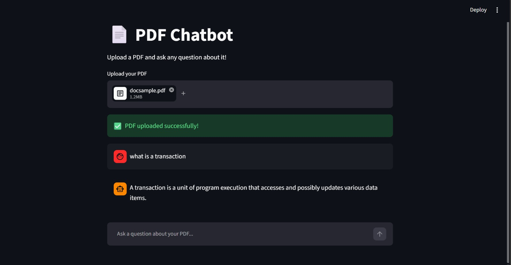

# 📄 RAG-Based PDF Q&A Chatbot

A Retrieval-Augmented Generation (RAG) system that lets you upload any PDF and ask questions about it in natural language, with answers grounded strictly in the document's content. Built during an AI/ML internship, with two parallel implementations to compare a manual RAG pipeline against a framework-based one.



---

## 🚀 What it does

- Upload any PDF and ask questions about it conversationally
- Retrieves the most semantically relevant chunks of the document (not just keyword matches)
- Generates answers using Google Gemini 2.5 Flash, constrained to only use retrieved context (reduces hallucination)
- Two implementations built side-by-side: a from-scratch manual pipeline, and a LangChain-based pipeline — to understand what a framework abstracts away

---

## 🛠️ Tech Stack

- **LLM**: Google Gemini 2.5 Flash
- **Embeddings**: all-MiniLM-L6-v2 (Sentence Transformers) — 384-dimension sentence embeddings
- **Vector Store**: ChromaDB
- **Framework**: LangChain, Streamlit
- **PDF Parsing**: pypdf / PyPDFLoader

---

## 📁 Project Structure

| File | Description |
|---|---|
| main.py | Manual RAG pipeline built from scratch — no LangChain abstractions |
| app.py | Streamlit UI for the manual pipeline |
| langchain_app.py | RAG pipeline rebuilt using LangChain's loaders, splitters, and vectorstore |
| langchain_ui.py | Streamlit UI (LangChain version) with dynamic PDF upload — **the main app** |

---

## 🧠 Strategies & Concepts Implemented

### 1. Manual pipeline before framework adoption
Rather than starting with LangChain, main.py implements the full RAG pipeline manually — PDF text extraction, custom chunking, embedding generation, and vector storage — before rebuilding the same logic with LangChain's abstractions (langchain_app.py). This was deliberate: understanding what a chunking function or a retriever actually does under the hood, before relying on a framework to do it, made debugging the framework version far easier later.

### 2. Chunking strategy & the boundary problem
Text is split into overlapping chunks (RecursiveCharacterTextSplitter / manual sliding window) rather than embedding the whole document, since embedding models have limited context and retrieval precision drops on long spans.

**Problem found during testing**: with chunk_size=500 and k=3 retrieval, factual definitions occasionally got cut off mid-sentence when a definition happened to straddle a chunk boundary — the retriever would return a chunk ending mid-sentence, and Gemini would (correctly) report the context was incomplete rather than hallucinate an ending.

**Fix**: tuned to chunk_size=1000, chunk_overlap=200, k=5 in langchain_ui.py. Larger chunks reduce the chance a single concept spans a boundary; higher overlap means boundary-adjacent content appears in more than one chunk; higher k increases the odds that if a concept *is* split, both halves get retrieved together.

### 3. Semantic search via embeddings (not keyword search)
Both the question and every chunk are converted into 384-dimensional vectors using all-MiniLM-L6-v2. Similarity is computed in vector space, so the system retrieves chunks that are conceptually related to the question, even if they don't share exact keywords — e.g., a question about "database rollback" can retrieve a chunk discussing "transaction atomicity" without either sharing that literal phrase.

### 4. Explicit distance metric selection
langchain_ui.py explicitly sets collection_metadata={"hnsw:space": "cosine"} when creating the ChromaDB collection, rather than relying on the default metric. Cosine similarity was chosen because it measures the angle between vectors rather than magnitude — better suited to sentence embeddings, where vector length can vary with sentence length but direction encodes meaning.

### 5. Context-constrained prompting to reduce hallucination
The prompt explicitly instructs the model: "Using ONLY the context below, answer the question." This forces the LLM to ground its answer in retrieved chunks rather than its own parametric knowledge — critical for a document-QA tool, where an answer that sounds right but isn't actually in the source PDF is worse than no answer.

### 6. Caching expensive setup with @st.cache_resource
PDF loading, chunking, embedding, and vector store creation only need to happen once per document — not on every user interaction. Both Streamlit apps wrap this setup in @st.cache_resource, so the expensive embedding step doesn't re-run every time a user sends a new chat message.

### 7. Iteration from static to dynamic input
app.py and langchain_app.py hardcode a single test PDF. langchain_ui.py evolved this into a real st.file_uploader, writing the uploaded file to a temporary path (tempfile.NamedTemporaryFile) so any user can query any PDF — turning a fixed test script into an actually usable tool.

### 8. Security practice: secrets kept out of source control
API keys are loaded via os.getenv() from a .env file (never hardcoded), and .env, venv/, and test data are excluded via .gitignore — standard practice for any repo that will be public.

---

## ⚙️ Setup & Installation

1. Clone the repo
   ```bash
   git clone https://github.com/Ishita-012/rag-pdf-chatbot.git
   cd rag-pdf-chatbot
   ```

2. Create a virtual environment and activate it
   ```bash
   python -m venv venv
   venv\Scripts\activate   # Windows
   ```

3. Install dependencies
   ```bash
   pip install -r requirements.txt
   ```

4. Add your Gemini API key — create a `.env` file in the root folder:
   ```
   GEMINI_API_KEY=your_api_key_here
   ```

5. Run the app
   ```bash
   streamlit run langchain_ui.py
   ```

---

## 📌 Note

A sample PDF used during development/testing is excluded from this repo. Upload your own PDF to test the app.

---

Built by Ishita